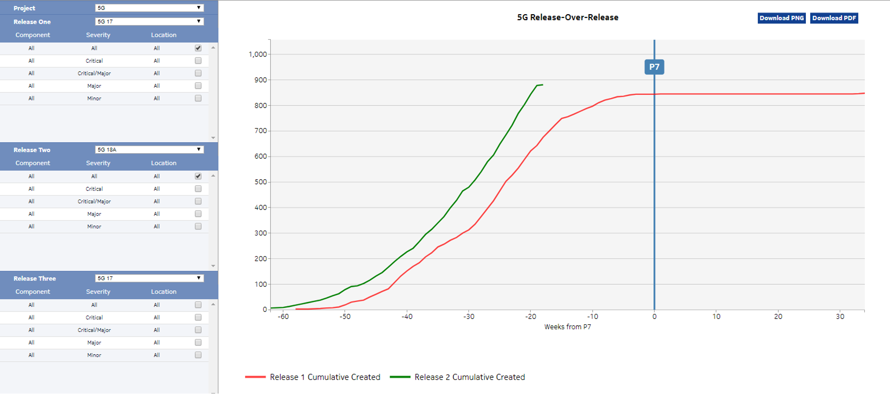

# Reliability Assurance Engine

This project contains two tools for software reliability assurance.

## SRGM

SRGM provides predictions based on current defect trends.
SRGM automatically detects the inflection points and generates a series of piece-wise exponential model: m(t)=a {1-exp(-bt)} as illustrated in the chart below.

Additional test data based examples of input and output of SRGM are

### Usage

1. Go to the srgm directory
2. Install the dependencies with `pip install -r requirements.txt`

## ePDM

eDPM performs prediction using a leading indicator such as features ready for test, test execution rate, development effort data in addition to current defect trend.

eDPM folder contains the following items:

- The [.py file](eDPM/edpm.py) is the python code
- two example input data:
  - [defect data](eDPM/defect_data.csv)
  - [feature data](eDPM/feature_data.csv)
- [One text file](eDPM/input_parameters.txt) represents some input parameters
- There is also an [example of the expect output values](eDPM/outputs.txt)

### Usage

1. Go to the srgm directory
2. Install the dependencies with `pip install -r requirements.txt`

## How to contriubte

We are happy to receive contributions in the form of pr-s.

## Copyright and Licensing

This project is licensed under [BSD-3-Cluse-Clear license](LICENSE).
